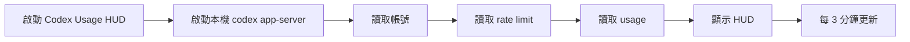
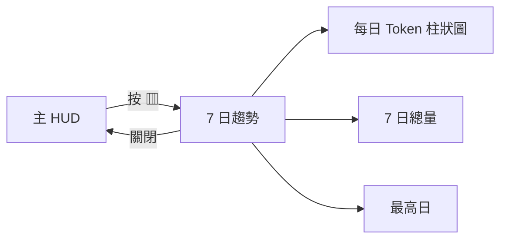
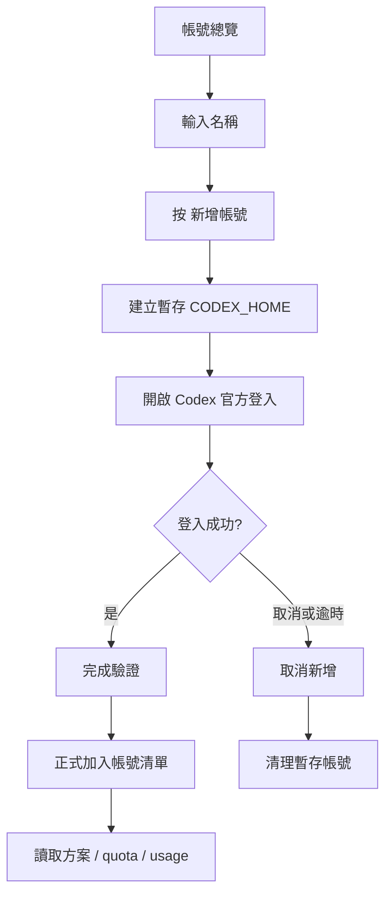
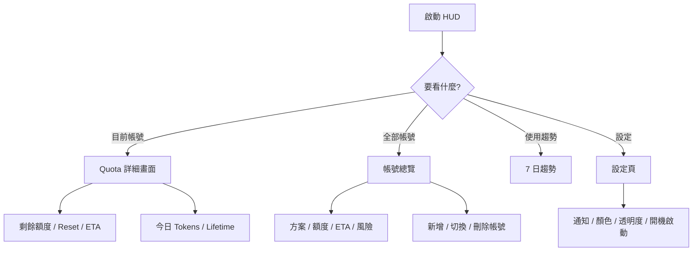

# Codex Usage HUD 使用說明書

> 適用版本：`v0.3.3` 以上
>
> 平台：Windows 10 / 11 x64
>
> 專案：`pop15106/codex-usage-hud`

Codex Usage HUD 是一個 Local First 的 Windows 桌面懸浮工具，用來查看 ChatGPT Codex 訂閱額度、Reset 時間、Burn Rate、ETA、風險狀態、Token 使用量與多帳號資訊。

本文件以「一般使用者」為主，從下載、安裝、操作、風險判讀、多帳號、通知到疑難排解完整說明。

---

## 目錄

1. [功能總覽](#1-功能總覽)
2. [使用前需求](#2-使用前需求)
3. [下載與安裝](#3-下載與安裝)
4. [第一次啟動](#4-第一次啟動)
5. [主畫面說明](#5-主畫面說明)
6. [移動與調整視窗大小](#6-移動與調整視窗大小)
7. [超迷你模式](#7-超迷你模式)
8. [風險狀態與 ETA 信心度](#8-風險狀態與-eta-信心度)
9. [Windows 額度通知](#9-windows-額度通知)
10. [7 日使用趨勢](#10-7-日使用趨勢)
11. [多帳號功能](#11-多帳號功能)
12. [設定](#12-設定)
13. [系統匣與開機啟動](#13-系統匣與開機啟動)
14. [資料儲存與隱私](#14-資料儲存與隱私)
15. [更新、Portable 與解除安裝](#15-更新portable-與解除安裝)
16. [Windows SmartScreen / 防毒警告](#16-windows-smartscreen--防毒警告)
17. [疑難排解](#17-疑難排解)
18. [常見問題](#18-常見問題)
19. [開發者與 Release 說明](#19-開發者與-release-說明)

---

## 1. 功能總覽

目前主要功能：

- 顯示 Codex 剩餘額度百分比。
- 顯示目前 quota window，例如 `5H`、`1W`。
- 顯示 Reset 倒數與實際 Reset 日期時間。
- 保存本機 quota 採樣資料。
- 計算 Burn Rate。
- 在資料成熟後計算 ETA。
- 依剩餘額度、官方 hard limit 與成熟 ETA 判斷：
  - `穩定`
  - `注意`
  - `危險`
- 顯示 ETA 信心度。
- 顯示今日 Tokens、Lifetime Tokens、最後更新時間。
- 顯示近 7 天 Token 使用趨勢。
- Windows 額度偏低、危險、恢復通知。
- 可自由拖曳與縮放 HUD。
- 記住最後位置與大小。
- 一鍵切換超迷你模式。
- 多帳號 Codex Home 隔離、方案與額度總覽。
- Installer 與 Portable 兩種版本。
- GitHub Release 自動產生 SHA-256 checksum。

---

## 2. 使用前需求

使用前請確認：

1. Windows 10 或 Windows 11 x64。
2. 已安裝 Codex CLI。
3. `codex` 指令已加入 PATH。
4. 主要 Codex CLI 已使用 ChatGPT 帳號登入。
5. Windows 已有 WebView2 Runtime。

可以先在 PowerShell 或 CMD 執行：

```powershell
codex --version
codex login status
```

正常情況會看到 Codex CLI 版本與登入狀態。

如果 `codex` 指令不存在，HUD 無法讀取 quota。

---

## 3. 下載與安裝

### 3.1 建議：Windows 安裝版

到 GitHub Releases：

https://github.com/pop15106/codex-usage-hud/releases/latest

下載：

```text
Codex.Usage.HUD_<版本>_x64-setup.exe
```

執行後依安裝精靈完成安裝。

目前使用 NSIS `currentUser` 安裝模式，一般情況不需要系統管理員權限。

### 3.2 Portable 免安裝版

如果不想安裝，可下載：

```text
Codex.Usage.HUD_<版本>_x64-portable.exe
```

直接執行即可。

> Portable 是「不需要安裝」，不是「完全不寫本機資料」。設定、quota history 與多帳號 Codex Home 仍會存在應用程式資料目錄。

### 3.3 驗證檔案 SHA-256

每個 GitHub Release 都附：

```text
SHA256SUMS.txt
```

PowerShell 可執行：

```powershell
Get-FileHash .\Codex.Usage.HUD_0.3.2_x64-setup.exe -Algorithm SHA256
```

再與 Release 中的 `SHA256SUMS.txt` 比對。

---

## 4. 第一次啟動

啟動後，HUD 會：

1. 啟動本機 `codex app-server`。
2. 讀取目前 Codex 帳號。
3. 讀取 rate-limit / quota window。
4. 讀取 Token usage。
5. 保存 quota 採樣至本機 SQLite。
6. 顯示剩餘額度與 Reset。

操作流程：



第一次啟動時 Burn Rate / ETA 需要累積資料，因此看到：

```text
正在建立消耗基線
ETA 學習中
```

是正常狀態。

---

## 5. 主畫面說明

單一帳號畫面主要分成四區：

```text
┌────────────────────────────────────────────┐
│ Codex   方案        狀態  更新  帳號  趨勢  設定 │  ← 標題列 / 可拖曳
├────────────────────────────────────────────┤
│ 1W  Codex                         99% 剩餘 │
│ ████████████████████████████████████████   │
│ ↻ 6天22小時             Reset 8/27 14:31 │
│ Burn Rate / ETA 信心度               穩定 │
├────────────────────────────────────────────┤
│ 今日 Tokens │ Lifetime │ Token 資料        │
└────────────────────────────────────────────┘
```

### 5.1 上方列

常見按鈕：

- `↻`：立即重新整理。
- `◎`：帳號總覽。
- `▥`：近 7 天趨勢。
- `⚙`：設定。
- `▭`：超迷你模式。
- `—`：隱藏至系統匣。

### 5.2 Quota 卡片

Quota 卡片會顯示：

- Window 長度，例如 `5H`、`1W`。
- 額度名稱 `Codex`。
- 剩餘百分比。
- 進度條。
- Reset 倒數。
- Reset 實際時間。
- Burn Rate。
- ETA / ETA 信心度。
- 風險狀態。

### 5.3 底部三格摘要

- `今日 Tokens`：Codex 官方 `account/usage/read` 已回報的「今天」Token bucket。官方尚未回報今天時顯示 `—`，不會用 `0` 代替。
- `Lifetime`：Codex 官方已回報的累積 Token 總量。
- `Token 資料`：Token usage 最新回報日期，例如 `截至 8/18`。這一格用來提醒你 Token 統計可能比 quota 額度資料延遲。

> Quota 與 Token usage 的更新速度不同。`account/rateLimits/read` 可以已經反映最新額度消耗，但 `account/usage/read` 的每日 Token buckets 仍可能落後數天。因此，HUD 不會把「尚未回報」解讀成「今天使用 0 Tokens」。

---

## 6. 移動與調整視窗大小

### 6.1 移動 HUD

只有最上方標題列可以拖曳移動。

內容區、Quota 卡片、空白區與底部統計不會觸發視窗移動。

### 6.2 調整大小

HUD 支援：

- 上邊。
- 下邊。
- 左邊。
- 右邊。
- 四個角落。

拖曳即可改變視窗大小。

右下角有小型 resize 提示。

### 6.3 記住最後位置與大小

一般模式下：

- 移動位置會自動保存。
- 視窗大小會自動保存。

下次啟動會嘗試恢復。

> 設定頁、趨勢頁與超迷你模式的暫時尺寸不會覆蓋一般 HUD 的主要尺寸。

---

## 7. 超迷你模式

按上方 `▭` 可切換。

超迷你模式適合：

- 長時間放在桌面角落。
- 不希望擋住 IDE、瀏覽器或遠端桌面。
- 只需要快速看 quota。

再次按下即可返回原本大小。

---

## 8. 風險狀態與 ETA 信心度

### 8.1 風險等級

| 狀態 | 意義 |
|---|---|
| 🟢 穩定 | 額度充足，或 ETA 尚不足以判定風險 |
| 🟡 注意 | 額度偏低，或成熟 ETA 顯示可能在 Reset 前耗盡 |
| 🔴 危險 | 額度很低、官方 hard limit，或成熟 ETA 顯示很快耗盡 |

### 8.2 v0.3.2 的風險規則

後端基本規則：

- 官方 hard limit / 剩餘近 0% → `危險`。
- 剩餘 `>= 80%` → 原則上 `穩定`。
- 剩餘 `<= 10%` → `危險`。
- 剩餘 `<= 25%` → `注意`。
- 剩餘介於 25%～80%：只有成熟 ETA 才會影響風險。
- 成熟 ETA 若預估在 Reset 前耗盡 → `注意`。
- 成熟 ETA 若預估 3 小時內耗盡 → `危險`。

因此像：

```text
99% 剩餘
只消耗過 1%
ETA 尚未成熟
```

會顯示：

```text
穩定 · ETA 學習中
```

不會因短期外推直接顯示 `注意`。

### 8.3 ETA 信心度

ETA 不會只靠單次速度直接外推。

ETA 完全成熟需要：

- 至少 3 個有效樣本。
- 實際 quota 使用差至少 2%。
- 短 window（例如 5H）：至少跨 30 分鐘。
- 約 1 天 window：至少跨 1 小時。
- 長 window（例如 1W）：至少跨 6 小時。

信心度未達 100% 時：

- Burn Rate 可以顯示目前學習狀況。
- ETA 不參與風險升級。
- 畫面會顯示 `ETA 學習中` 或 `ETA 信心 xx%`。

### 8.4 自訂提醒門檻

設定中可調整：

- 低額度提醒。
- 危險提醒。

前端提醒門檻會套用在目前帳號的顯示與通知上。

---

## 9. Windows 額度通知

開啟設定中的：

```text
額度通知
```

系統會在需要通知時要求 Windows Notification 權限。

可能通知：

- 額度進入注意狀態。
- 額度進入危險狀態。
- 額度 Reset / 恢復後重新回到安全狀態。

通知會帶上帳號名稱，方便多帳號環境辨識。

HUD 不會在安全狀態一啟動就強制要求通知權限。

---

## 10. 7 日使用趨勢

按上方 `▥`。

趨勢頁顯示：

- 最新已回報日期往前 7 天的每日 Token 使用量。
- 該 7 日區間總量。
- 使用量最高日期。
- Token usage 若有延遲，會在頁面下方標示最新回報日期。

操作流程：



多帳號模式下，趨勢只顯示目前選取帳號的資料。

趨勢圖不以電腦今天日期強制補零；它會以 Codex 官方「最新已回報日期」為終點，因此尚未回報的今天／昨天不會被錯誤畫成 0。

---

## 11. 多帳號功能

### 11.1 設計方式

每個額外帳號使用獨立：

```text
CODEX_HOME
```

因此：

- 登入憑證彼此隔離。
- quota history 彼此隔離。
- Burn Rate / ETA 不會跨帳號混算。
- HUD 不需要複製 access token。

### 11.2 帳號總覽

按上方 `◎`。

總覽會顯示：

- 每個帳號名稱。
- Email。
- 方案，例如 `Plus`、`Pro`、`Prolite`。
- 每個 Codex window 剩餘額度。
- Reset。
- ETA。
- 風險。
- 今日 Tokens。

上方聚合資訊：

- 全部帳號今日 Tokens 總量。
- 最高風險帳號。
- 最快 Reset 帳號。

> 不會把不同帳號的百分比直接相加，例如不會顯示「總剩餘 180%」，因為這個數值沒有實際意義。

### 11.3 切換帳號

直接點帳號列。

HUD 會切換成該帳號的詳細畫面。

這個切換只影響 HUD 自己的監看環境，不會偷偷修改你另外開啟的 Codex CLI / VS Code Codex 程序。

### 11.4 新增額外帳號

流程：



重要：

**認證完成前，帳號不會正式加入清單。**

如果登入頁被關閉，可按「取消新增」，暫存資料會被移除。

### 11.5 刪除額外帳號

在帳號總覽中按 `刪除`。

刪除只會移除：

- HUD 建立的該帳號 `CODEX_HOME`。
- 該帳號的本機 quota history。
- 該帳號的 HUD 設定資料。

主要帳號不可從 HUD 刪除。

---

## 12. 設定

按 `⚙`。

設定頁會暫時把視窗放大，關閉後恢復原本 HUD 尺寸。

### 外觀

可調：

- 冰霧。
- 清透。
- 煙霧。
- Accent Color。
- 自訂顏色。
- 透明度。

### 額度通知

可調：

- 是否啟用 Windows 通知。
- 注意門檻。
- 危險門檻。

### 行為

可調：

- 固定最上層。
- 開機自動啟動。

---

## 13. 系統匣與開機啟動

HUD 有 Windows 系統匣圖示。

系統匣選單：

- 顯示 / 隱藏。
- 重新整理。
- 退出。

按 HUD 的 `—`：

- 只是隱藏到系統匣。
- 不代表程式退出。

背景仍會定期讀取 quota。

若設定開機啟動，登入 Windows 後 HUD 會自動啟動。

---

## 14. 資料儲存與隱私

設計原則：Local First。

不會：

- 建立額外雲端 HUD 帳號。
- 上傳 quota history 至第三方伺服器。
- 爬 ChatGPT 網頁。
- 讀取瀏覽器 Cookie。
- 複製或匯出 Codex access token。

會保存在本機：

- HUD 外觀設定。
- 視窗位置與大小。
- 額度歷史 SQLite。
- 多帳號 `CODEX_HOME`。

主要帳號 history：

```text
usage-history.db
```

額外帳號：

```text
usage-history-account-xxxxxxxx.db
```

---

## 15. 更新、Portable 與解除安裝

### 更新

目前採 GitHub Release 手動更新。

步驟：

1. 到 Releases。
2. 下載新版 Installer。
3. 執行安裝。

一般情況會覆蓋應用程式本體，本機設定與 history 保留在 App Data。

### Portable

直接用新版 Portable EXE 取代舊檔即可。

### 解除安裝

Installer 版本可透過 Windows：

```text
設定 → 應用程式 → 已安裝的應用程式
```

移除 Codex Usage HUD。

如果希望連本機歷史與多帳號資料一起清除，需要另外刪除該應用程式的 App Data。

---

## 16. Windows SmartScreen / 防毒警告

目前 GitHub Release 預設可能是**未簽章** EXE。

因此 Windows SmartScreen、企業 EDR 或防毒可能出現：

- 未知發布者。
- 低信譽應用程式。
- 新建立 EXE 警告。
- 企業政策封鎖。

這不等於程式被判定為惡意軟體。

專案已具備 Windows Code Signing pipeline，但正式簽章需要：

```text
WINDOWS_CERTIFICATE_BASE64
WINDOWS_CERTIFICATE_PASSWORD
```

對公司管理電腦：

**請遵守公司資安政策，不建議繞過 EDR / 防毒或公司應用程式白名單限制。**

---

## 17. 疑難排解

### 17.1 顯示「無法讀取 Codex 額度」

先執行：

```powershell
codex --version
codex login status
codex app-server
```

確認 Codex CLI 可以正常啟動。

### 17.2 `codex` 不是內部或外部命令

代表 Codex CLI：

- 未安裝，或
- 未加入 PATH。

重新安裝 Codex CLI 或修正 PATH。

### 17.3 顯示 ETA 學習中

正常。

ETA 需要：

- 足夠樣本。
- 足夠時間跨度。
- 至少 2% 真實消耗差。

週窗通常需要較長時間才能成熟。

### 17.4 額度 99% 但舊版顯示注意

請升級到 `v0.3.2` 以上。

v0.3.2 已避免高剩餘額度被未成熟 ETA 誤判。

### 17.5 新增帳號後關閉登入頁

新流程中：

- 尚未驗證的帳號不會正式加入。
- 按「取消新增」即可清理暫存資料。

### 17.6 主帳號明明有資料卻顯示尚未登入

請升級至 `v0.3.1` 以上。

只要 app-server 能正常回傳 snapshot / quota，即視為可用帳號。

### 17.7 設定頁文字互相重疊

請確認使用最新版。

目前設定頁會：

- 使用獨立不透底面板。
- 暫時放大視窗。
- 關閉後恢復原尺寸。

### 17.8 視窗拖不動

請從最上方標題列拖曳。

內容區故意不支援拖曳，避免使用卡片時誤移動整個視窗。

### 17.9 按 `—` 後找不到程式

程式仍在系統匣。

從系統匣選：

```text
顯示 / 隱藏
```

即可恢復。

---

## 18. 常見問題

### Q：HUD 會把我的 ChatGPT Token 傳出去嗎？

不會。

HUD 使用本機 Codex App Server，不建立自己的雲端帳號。

### Q：多帳號會共用登入憑證嗎？

不會。

額外帳號使用各自獨立 `CODEX_HOME`。

### Q：多帳號切換會改掉 VS Code Codex 帳號嗎？

不會。

目前是一鍵切換「HUD 監看的帳號」。

### Q：為什麼週額度 ETA 很久都在學習？

週窗至少需要約 6 小時跨度、3 個樣本與 2% 消耗差，避免短期外推造成誤判。

### Q：為什麼剩 80% 以上都顯示穩定？

這是 v0.3.2 的防誤判設計。

高剩餘額度不應因不成熟 Burn Rate 直接升級警示；Codex 官方 hard limit 例外。

### Q：公司電腦被防毒擋怎麼辦？

不要繞過公司防毒或 EDR。

使用個人電腦，或依公司流程申請軟體白名單 / 簽章版本。

---

## 19. 開發者與 Release 說明

### 本機檢查

```powershell
npm run check
cargo test --manifest-path src-tauri/Cargo.toml
```

### Windows Build

```powershell
npm run tauri build -- --no-sign
```

輸出：

```text
src-tauri\target\release\codex-usage-hud.exe
src-tauri\target\release\bundle\nsis\Codex Usage HUD_<版本>_x64-setup.exe
```

### GitHub Release

推送 `v*` tag 後，GitHub Actions 會：

1. Checkout。
2. Setup Node.js / Rust。
3. 驗證專案。
4. Build Portable EXE。
5. 有憑證時簽署 Portable。
6. Build NSIS Installer。
7. 有憑證時簽署 Installer。
8. 產生 `SHA256SUMS.txt`。
9. 自動發布 GitHub Release。

---

## 操作流程總覽



---

如果操作結果與本文件不同，請先確認 GitHub Release 版本是否為 `v0.3.2` 或更新版本。
